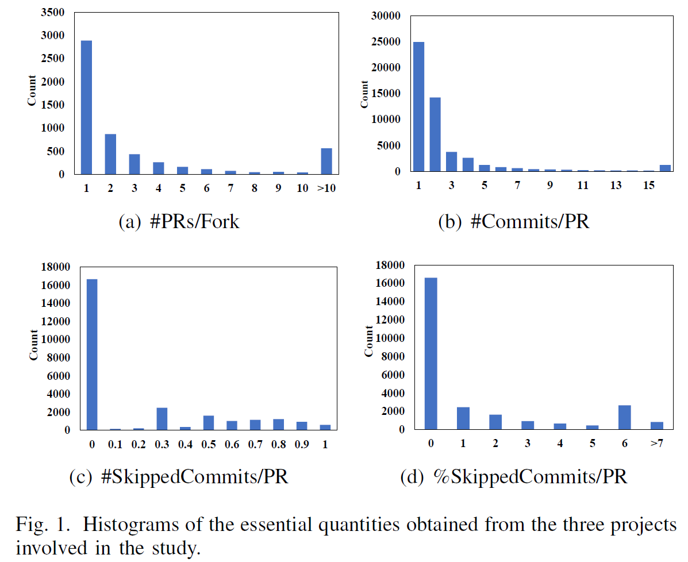
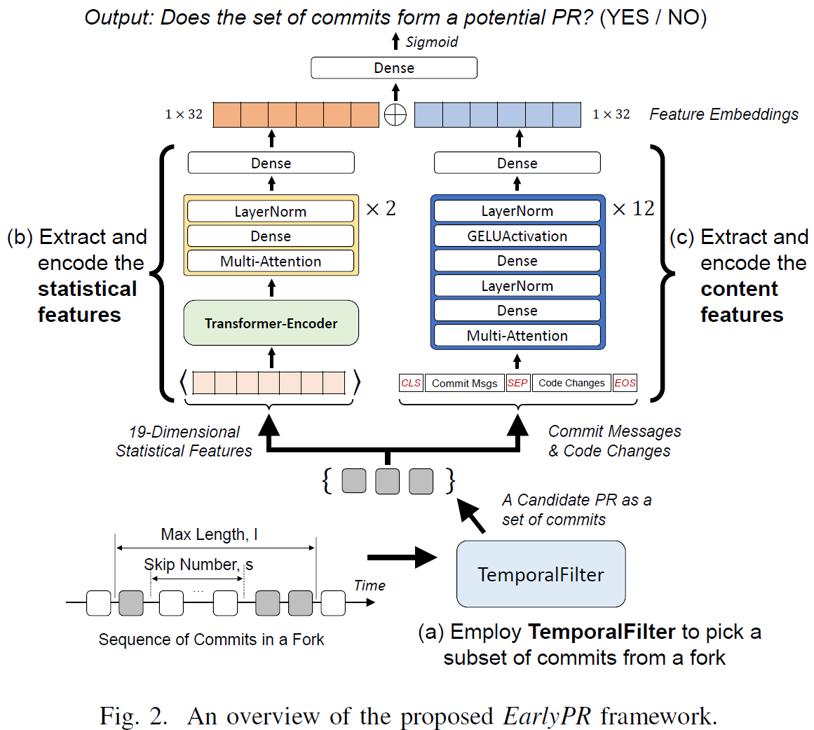
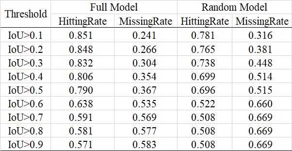
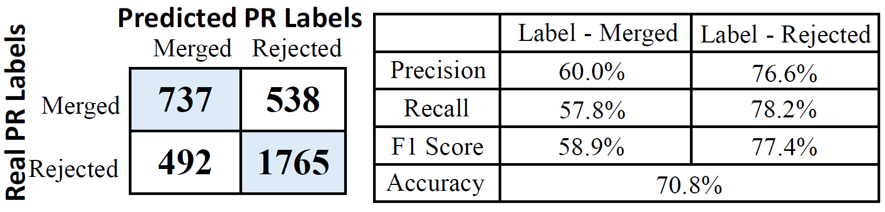

# EarlyPR: Early Prediction of Potential Pull-Requests from Forks
This repository contains the code necessary to replicate the findings presented in the paper "EarlyPR: Early Prediction of Potential Pull-Requests from Forks".

## Folder Structure
<span style="color:black">●</span> datasets: data and preprocessing method for generating the required dataset.

<span style="color:black">●</span> pr_run.py: The training entrance for RQ1.

<span style="color:black">●</span> mergedpr_run.py: The training entrance for RQ2.

<span style="color:black">●</span> test.py: The overall test and TemporalFilter implemented  for RQ1 and RQ2.

<span style="color:black">●</span> confusionMatrixCalculation.py: Running this script could directly derive the confusion matrix and the metrics conclusion for RQ1 and RQ2.

<span style="color:black">●</span> Tables folder: This folder contains the tables and figures generated by this repository, which are also presented in the paper.

<span style="color:black">●</span> CONSTANT: This folder contains the constant variables for the whole project, including mongoDB connection, Redis connection and Mapping tables.

<span style="color:black">●</span> performPredict folder The metrics evaluated for RQ1 and RQ2.

<span style="color:black">●</span> models folder : The main experiments and ablation model introduced.

<span style="color:black">●</span> saveRunningResults folder : The running results of the prediction process. It is composed of the prediction results of the PRs and merged PRs for main experiments including EarlyPR and RandomPR.

The core implementation of EarlyPR is mainly realized in the models folder, while the implementation of the statistical process is in the datasets/querySets_GenerateTestCommits.py file.
The intermediate data obtained from the statistics is placed in the "datasets/data" directory.
<p align="center"> &nbsp;&nbsp;&nbsp;&nbsp;  </p>

## Running the scripts
This paper contains two research questions and 16 different repositories, and the code for each research question is in the corresponding file.

The command and the parameters for training the PRs' prediction process is as follows, change the repo_name to the repository you want to train.
```python
nohup python -u pr_run.py --repo_name corefx --do_train --device 0 > trainCorefx.log 2>&1 &
```
The command and the parameters for training the merged PRs' prediction process is as follows:
```python
nohup python -u mergedpr_run.py --repo_name corefx --do_train --device 0 > trainMergeCorefx.log 2>&1 &
```
The parameters needed for testing  PRs' and mergedPRs' prediction codes are as follows:
```python
nohup python -u pr_run.py --do_test --mergedPRTest True --repo_name corefx  --modelPath "output/pr_output/servo/"  --MPmodelPath "output/mergepr_output/servo/" > TestCorefx.log 2>&1 &
```
We also provide the running results of the prediction process in the folder **saveRunningResults**. 
It contains the prediction results of the PRs and merged PRs for main experiments including **EarlyPR** and **RandomPR**. 
You can directly execute the following command to obtain the main experimental results presented in Tables 3 and Figure 3.
```python
python confusionMatrixCalculation.py
```
<p align="center">  &nbsp;&nbsp;&nbsp;&nbsp;  </p>

## Requirements
The requirements for running this repository are all in the requirements.yaml file. You can install them by running the following command:
```python
conda env create -f requirement.yaml
```